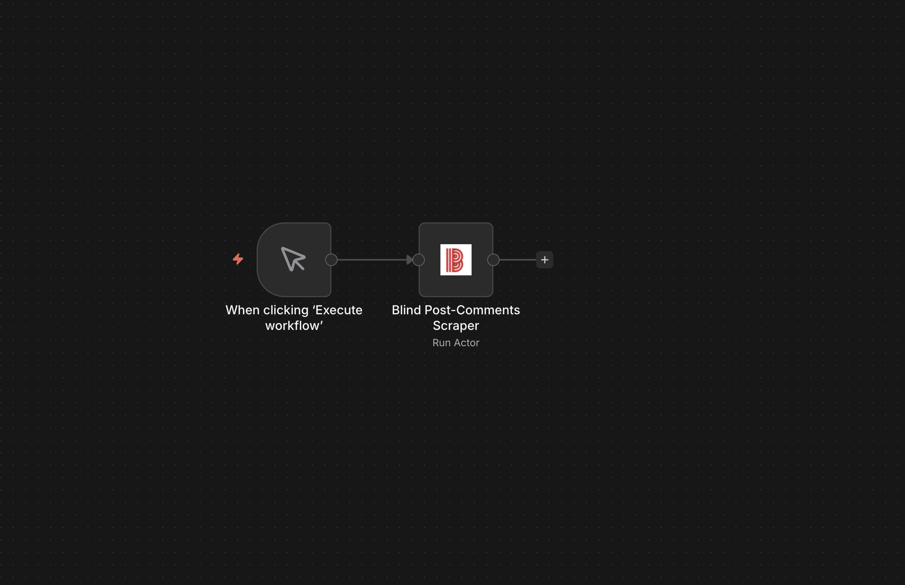
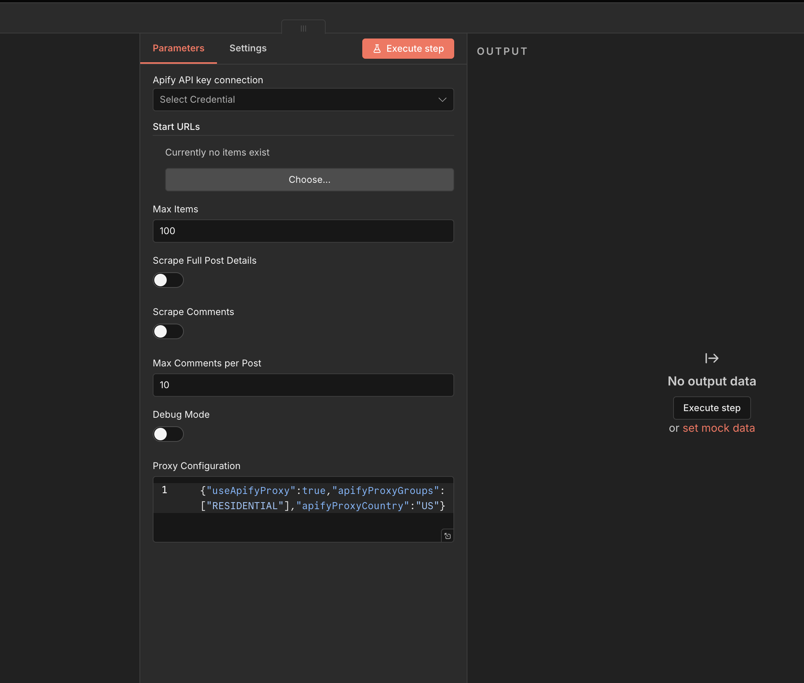

# n8n-nodes-hypebridge-actors

n8n community nodes for [Hypebridge](https://hypebridge.io) Apify actors — event scrapers, influencer marketing tools, and data extraction.



## Table of Contents

- [Installation](#installation)
- [Nodes Included](#nodes-included)
- [Credentials](#credentials)
- [Usage](#usage)
- [Compatibility](#compatibility)
- [Support](#support)

## Installation

### n8n Cloud / Desktop

1. Go to **Settings → Community Nodes**
2. Click **Install a community node**
3. Enter `n8n-nodes-hypebridge-actors`
4. Click **Install**

### Self-hosted n8n

```bash
npm install n8n-nodes-hypebridge-actors
```

Then restart n8n.

## Nodes Included

### Event Scrapers

| Node | Description | Apify Actor |
|------|-------------|-------------|
| **Eventbrite Search** | Scrape Eventbrite search, discovery, and event detail pages | [hypebridge/eventbrite-search](https://apify.com/hypebridge/eventbrite-search) |
| **Dice.fm** | Scrape concerts, festivals, DJ events, and live shows | [hypebridge/dice-fm](https://apify.com/hypebridge/dice-fm) |
| **Shotgun Live** | Scrape electronic music, nightlife, and party events worldwide | [hypebridge/shotgun-live](https://apify.com/hypebridge/shotgun-live) |
| **Posh VIP** | Scrape nightlife, concerts, and party events | [hypebridge/posh-vip](https://apify.com/hypebridge/posh-vip) |
| **Prekindle** | Scrape event listings and venue information | [hypebridge/prekindle](https://apify.com/hypebridge/prekindle) |
| **Eventnoire** | Scrape Black culture events | [hypebridge/eventnoire](https://apify.com/hypebridge/eventnoire) |

### Influencer Marketing

| Node | Description | Apify Actor |
|------|-------------|-------------|
| **Influencer Discovery** | Discover and rank influencers on Instagram + TikTok based on brand fit | [hypebridge/influencer-discovery-agent-instagram-tiktok](https://apify.com/hypebridge/influencer-discovery-agent-instagram-tiktok) |
| **Influencer Evaluation** | Deep evaluation of influencer profiles with audience insights | [hypebridge/influencer-evaluation-agent-instagram-tiktok](https://apify.com/hypebridge/influencer-evaluation-agent-instagram-tiktok) |

### Other Scrapers

| Node | Description | Apify Actor |
|------|-------------|-------------|
| **Eater** | Scrape restaurant information from Eater.com guides | [hypebridge/eater](https://apify.com/hypebridge/eater) |
| **TeamBlind** | Scrape posts and discussions from TeamBlind | [hypebridge/blind-post-comments-scraper](https://apify.com/hypebridge/blind-post-comments-scraper) |
| **DraftKings Predictions** | Scrape prediction markets and odds | [hypebridge/draftkings-predictions](https://apify.com/hypebridge/draftkings-predictions) |

## Credentials

All nodes require an Apify API token:

1. Sign up at [apify.com](https://apify.com)
2. Go to **Settings → Integrations → API tokens**
3. Copy your token
4. In n8n, create credentials for **Apify API** and paste your token

Two authentication methods are supported:
- **API Token** — Works everywhere (recommended)
- **OAuth2** — Available on n8n Cloud only

## Usage

### Basic Workflow

1. Add a trigger node (e.g., Manual Trigger, Schedule, Webhook)
2. Add any Hypebridge node
3. Configure your Apify credentials
4. Set input parameters (URLs, search queries, etc.)
5. Execute the workflow



### As an AI Agent Tool

All nodes have `usableAsTool: true`, making them available as tools for n8n AI Agents:

1. Add an **AI Agent** node
2. Connect a Hypebridge node as a tool
3. The agent can invoke scrapers based on user prompts

### Example: Event Discovery Pipeline

```
Schedule Trigger → Eventbrite Search → Filter → Google Sheets
```

Automatically collect new events daily and save to a spreadsheet.

## Compatibility

| n8n Version | Status |
|-------------|--------|
| 1.57.0+ | ✅ Tested |
| 1.40.0+ | ✅ Should work |

## Support

- **Apify Actors**: [apify.com/hypebridge](https://apify.com/hypebridge)
- **Issues**: [GitHub Issues](https://github.com/hypebridge/n8n-nodes-hypebridge-actors/issues)
- **n8n Community**: [community.n8n.io](https://community.n8n.io/)

## License

MIT
